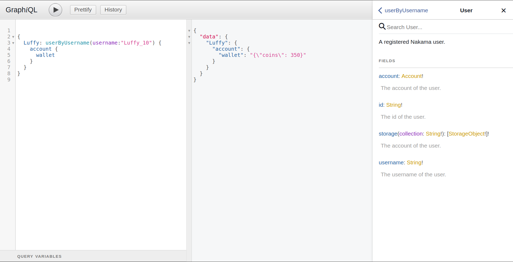

# poseidon
> Opinionated extended apis and tools on top of the Nakama server

## Features

### Storage Collection Accessors

Allows for more fluent use of Nakama's storage collections, taking care of json marshalling and unmarshalling, default values and bulk reads.

```go
import (
	"context"

	"github.com/heroiclabs/nakama/runtime"
	"github.com/mastern2k3/poseidon/storage"
)

var (
	statsAccessor = &storage.CollectionAccessor{
		CollectionID: "stats",
		KeyID:        "matchesPlayed",
		// An empty model used for unmarhalling
		ModelFactory: func() interface{} { return new(MatchStats) },
		// A default value for when a record does not exist
		DefaultFactory: func() interface{} {
			return &MatchStats{
				WinningStreak: 0,
				MatchesPlayed: 0,
			}
		},
	}
)

type MatchStats struct {
	MatchesPlayed uint `json:"matchesPlayed"`
	WinningStreak uint `json:"winningStreak"`
}

func GetMatchStats(ctx context.Context, nk runtime.NakamaModule, userIDs []string) (map[string]*MatchStats, error) {

	dx, err := statsAccessor.GetOrDefaultList(ctx, nk, userIDs)

	if err != nil {
		return nil, err
	}

	stats := map[string]*MatchStats{}

	for userID, d := range dx {
		stats[userID] = d.(*MatchStats)
	}

	return stats, nil
}
```

### RPC Routes

Provide json marshalling and unmarshalling for RPC requests and responses, as well as a nicer way to register an array of RPC handlers.

```go
package services

import (
	"context"
	"database/sql"
	"fmt"
	"log"

	"github.com/heroiclabs/nakama/runtime"
	"github.com/mastern2k3/poseidon/rpc"
)

var (
	MyRoutes = []rpc.RPCRoute{
		&rpc.JsonRoute{"json_route", func() interface{} { return &[]string{} }, jsonRoute},
		&rpc.StringRoute{"string_route", stringRoute},
	}
)

type SomeResponse struct {
	Data map[string]string `json:"data"`
}

func jsonRoute(ctx context.Context, logger runtime.Logger, db *sql.DB, nk runtime.NakamaModule, input interface{}) (interface{}, error) {

	userIDs := input.(*[]string)

	logger.Println(userIDs)

	return &SomeResponse{
		Data: map[string]string {
			"hello": "world",
		}
	}, nil
}

func stringRoute(ctx context.Context, logger runtime.Logger, db *sql.DB, nk runtime.NakamaModule, input string) (string, error) {

	logger.Println(input)

	return "ok", nil
}
```

And in your initialization code:

```go
func InitModule(ctx context.Context, logger runtime.Logger, db *sql.DB, nk runtime.NakamaModule, initializer runtime.Initializer) error {
	if err := rpc.RegisterRoutes(initializer, services.MyRoutes); err != nil {
		return err
	}
}
```

### GraphQL endpoint with bundled GraphiQL interface

Provides a GraphQL endpoint and bundled GraphQL ui for easy browsing of the server data.



The UI is served on port 8090 so remember to expose it.
